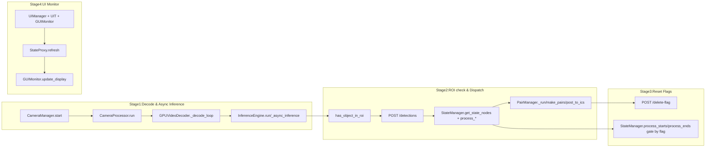

# Flow Architecture (Stage 1-4)

Hệ thống hiện tại có 2 service chính chạy trong Docker:
- `api_server` (FastAPI): nhận detection, lưu state/ready lists, tạo order/task và cung cấp endpoint cho UI.
- `ai_worker`: decode RTSP bằng FFmpeg (NVDEC) + chạy YOLO inference (CUDA streams async) + gửi detection về `api_server`.

UI monitor chạy local (ngoài Docker) để poll state và hiển thị.

## Sơ đồ tổng quan



## Stage 1: NVDEC decode + async inference

Luồng dữ liệu trong code:
- `core/camera_manager.py` tạo `CameraProcessor` cho từng camera và tạo `result_queue` per camera.
- `core/camera_processor.py`:
  - khởi tạo `GPUVideoDecoder(rtsp)`
  - gọi `cap.wait_ready()` để đợi frame đầu tiên
  - đọc frame `ret, frame = cap.read()` và push vào `InferenceEngine.put_frame_with_drop(frame, cam_id)`
  - chờ `detections = result_queue.get(...)`
- `core/inference_engine.py`:
  - gom frames thành batch (`_collect_batch()`)
  - chạy YOLO trong nhiều `torch.cuda.Stream()` theo async pipeline (`_async_inference()` + `stream.record_event()`)
  - khi `event.query()` báo xong thì `_distribute_results()` đưa detections về đúng `cam_id`.

Lưu ý quan trọng về “zero copy”:
- Mặc dù decode dùng GPU (NVDEC), nhưng `GPUVideoDecoder` đang đọc `stdout` FFmpeg raw BGR và convert sang `numpy` (frames đi qua CPU memory). Vì vậy mục tiêu “inference hoàn toàn trên GPU + zero copy” hiện không đạt full theo đúng nghĩa; tuy nhiên inference vẫn chạy trên GPU với async CUDA streams.

## Stage 2: ROI check -> gửi detection -> dispatch tới ICS

Trong `CameraProcessor.run()`:
- Với mỗi ROI (`node_id`, `roi`) gọi `core/detection.py`:
  - `has_object_in_roi(detections, roi, node_id, use_gpu=True)`
- Ở mode worker Docker (không có `state_manager` trực tiếp), camera thread dùng `worker/api_client.py` để:
  - `POST /detections` lên `api_server`

Trên `api_server`:
- `api/api_server.py` xử lý:
  - `POST /detections` -> `StateManager.get_state_nodes(node_id, detected)`
- `PairManager` chạy background thread trong `api/main_api.py`:
  - gọi `state_manager.process_starts()` và `state_manager.process_ends()` để đưa node vào `ready_*`
  - ghép pair hợp lệ (`make_pairs()`), phân loại empty/double/single
  - nếu POST tới ICS thành công (`post_to_ics()`), gọi `state_manager.set_pair_used(...)` để set `flag=True` và lưu mapping theo `orderId` (tránh dispatch lặp).

## Stage 3: Reset flags (webhook + auto lifecycle)

Reset chủ động qua webhook:
- `api/api_server.py` endpoint `POST /delete-flag` nhận:
  - `status == 3`: reset toàn bộ (normal + empty) cho `orderId`, đồng thời clean `order_mapping/pair_mapping`.
  - `status == 23`: chỉ reset empty pairs, giữ normal pairs còn lại.

Auto lifecycle để “không lặp”:
- `StateManager.process_starts()`/`process_ends()` chỉ thêm node vào `ready_*` khi `data["flag"]` đang `False`.
- Vì vậy sau khi webhook reset set `flag=False` và dọn `ready_*`, các chu kỳ dispatch kế tiếp sẽ hoạt động đúng.

## Stage 4: UI Monitor (poll state + hiển thị)

Luồng UI hiện tại:
- `ui/main_ui.py`:
  - khởi tạo `APIClient(API_URL)` (mặc định `http://localhost:5000`)
  - chờ `wait_for_api()`
  - khởi tạo `UIT` -> `GUIMonitor`
- `ui/state_proxy.py`:
  - `StateProxy.refresh()` poll định kỳ:
    - `GET /state/points`
    - `GET /state/ready-lists`
- `ui/gui_monitor.py`:
  - `update_display()` gọi `StateProxy.refresh()` rồi render state/flag/time lên UI.

Lưu ý “reset thủ công”:
- Hàm `GUIMonitor.toggle_flag()` chỉ toggle `self.state_manager.points[point_id]["flag"]` trong cache UI.
- Khi `use_proxy=True`, `update_display()` sẽ refresh từ API (500ms) nên giá trị “toggle thủ công” có thể bị ghi đè trở lại theo state thật trên `api_server`.

## Cách chạy project hiện tại

1. Start Docker services (`api_server` + `ai_worker`)

Từ thư mục root `d:\Honda\ai_project`:
```powershell
docker compose up --build -d api_server ai_worker
```

2. Chạy UI local (Tkinter)

```powershell
cd d:\Honda\ai_project\ai-nvdec-snapshot-2task-processor-docker
python ui/main_ui.py
```

Nếu UI không truy cập được API qua `http://localhost:5000`, hãy set biến môi trường `API_URL` cho đúng IP host mà `docker-compose.yml` publish (ví dụ `http://192.168.1.30:5000`).