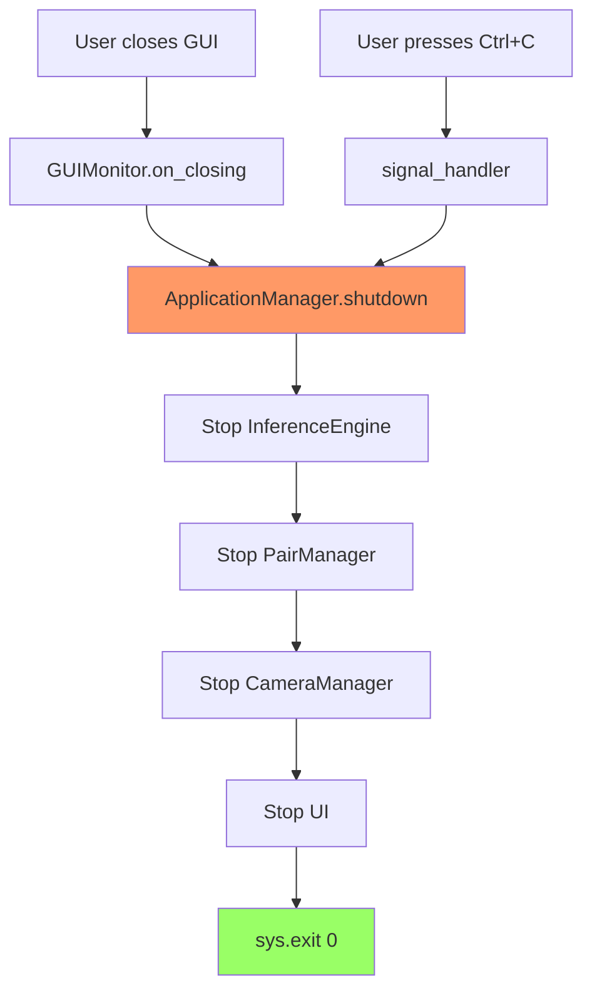

# Graceful Shutdown Implementation

## Overview

Hệ thống đã được implement graceful shutdown để đảm bảo tất cả threads và resources được dọn dẹp đúng cách khi người dùng tắt GUI hoặc nhấn Ctrl+C.

## Architecture

### Shutdown Flow



## Components Modified

### 1. main_ai.py - ApplicationManager

**New Class: `ApplicationManager`**
- Quản lý lifecycle của tất cả components
- Lưu trữ references đến tất cả components
- Implement `shutdown()` method

**Key Features:**
```python
class ApplicationManager:
    def __init__(self):
        self.components = {}  # Store all components
        self.running = False
    
    def initialize(self):
        # Create and store all components
        # Pass shutdown_callback to UI
        
    def shutdown(self):
        # Gracefully stop all components in order
```

**Shutdown Order:**
1. InferenceEngine (stop processing new frames)
2. PairManager (stop pair checking)
3. CameraManager (stop camera threads)
4. UI (close GUI window)
5. sys.exit(0)

### 2. ui/gui_monitor.py - Window Close Handler

**Changes:**
- Accept `shutdown_callback` parameter
- Register `WM_DELETE_WINDOW` protocol
- Call shutdown callback when window closes

**Implementation:**
```python
def __init__(self, state_manager, validate_pairs, shutdown_callback=None):
    self.shutdown_callback = shutdown_callback
    self.window.protocol("WM_DELETE_WINDOW", self.on_closing)

def on_closing(self):
    logger.info("GUI closing requested by user")
    if self.shutdown_callback:
        self.window.destroy()
        self.shutdown_callback()
```

### 3. ui/ui_thread.py - UI Thread Manager

**Changes:**
- Accept and pass `shutdown_callback` to GUIMonitor
- Improved `stop()` method with error handling
- Store thread reference

**Implementation:**
```python
def __init__(self, state_manager, validate_pairs, shutdown_callback=None):
    self.shutdown_callback = shutdown_callback

def stop(self):
    if self.gui and self.gui.window:
        try:
            self.gui.window.quit()
            self.gui.window.destroy()
        except Exception as e:
            logger.error(f"Error stopping GUI: {e}")
```

### 4. core/camera_manager.py - Camera Thread Cleanup

**Improved `stop()` method:**
```python
def stop(self):
    # Set running flag to False
    for thread in self.threads:
        if thread.is_alive():
            thread.running = False
    
    # Wait for threads to finish (with timeout)
    for thread in self.threads:
        if thread.is_alive():
            thread.join(timeout=2.0)
    
    # Log status
    alive_count = sum(1 for t in self.threads if t.is_alive())
    if alive_count > 0:
        logger.warning(f"{alive_count} threads still alive")
```

## Signal Handling

**Ctrl+C and SIGTERM handling:**
```python
def signal_handler(sig, frame):
    logger.info("Received signal, shutting down...")
    app_manager.shutdown()

signal.signal(signal.SIGINT, signal_handler)   # Ctrl+C
signal.signal(signal.SIGTERM, signal_handler)  # kill command
```

## Shutdown Sequence Detail

### Step 1: Trigger
```
User Action:
├─ Close GUI window [X]
└─ Press Ctrl+C
```

### Step 2: Callback Chain
```
GUI Close → on_closing() → shutdown_callback() → ApplicationManager.shutdown()
Ctrl+C → signal_handler() → ApplicationManager.shutdown()
```

### Step 3: Component Shutdown
```
1. InferenceEngine.stop()
   └─ Set running = False
   └─ Pending batches complete
   └─ CUDA streams cleanup
   
2. PairManager.stop()
   └─ Set running = False
   └─ Thread.join(timeout=5)
   
3. CameraManager.stop()
   └─ Set all camera threads running = False
   └─ Join all threads (timeout=2s each)
   └─ Log alive thread count
   
4. UI.stop()
   └─ window.quit()
   └─ window.destroy()
```

### Step 4: Exit
```
sys.exit(0) → Clean process termination
```

## Logging

**Shutdown logs:**
```
2026-03-03 10:00:00 - INFO - GUI closing requested by user
2026-03-03 10:00:00 - INFO - Triggering shutdown callback...
2026-03-03 10:00:00 - INFO - ==================================================
2026-03-03 10:00:00 - INFO - STARTING GRACEFUL SHUTDOWN
2026-03-03 10:00:00 - INFO - ==================================================
2026-03-03 10:00:00 - INFO - Stopping InferenceEngine...
2026-03-03 10:00:00 - INFO - Stopping InferenceEngine...
2026-03-03 10:00:00 - INFO - Stopping PairManager...
2026-03-03 10:00:00 - INFO - Stopping CameraManager...
2026-03-03 10:00:01 - INFO - Stopping all camera threads...
2026-03-03 10:00:03 - INFO - All camera threads stopped successfully
2026-03-03 10:00:03 - INFO - Stopping UI...
2026-03-03 10:00:03 - INFO - GUI stopped
2026-03-03 10:00:03 - INFO - ==================================================
2026-03-03 10:00:03 - INFO - GRACEFUL SHUTDOWN COMPLETED
2026-03-03 10:00:03 - INFO - ==================================================
```

## Error Handling

### 1. Thread Won't Stop
```python
# Timeout after 2 seconds per thread
thread.join(timeout=2.0)

# Log warning if still alive
if alive_count > 0:
    logger.warning(f"{alive_count} threads still alive")
```

### 2. GUI Already Destroyed
```python
try:
    self.gui.window.quit()
    self.gui.window.destroy()
except Exception as e:
    logger.error(f"Error stopping GUI: {e}")
```

### 3. Component Not Initialized
```python
if 'inference_engine' in self.components:
    self.components['inference_engine'].stop()
```

## Testing Shutdown

### Test 1: GUI Close
```bash
# Run application
python main_ai.py

# Click [X] button on GUI window
# Expected: Clean shutdown with logs
```

### Test 2: Ctrl+C
```bash
# Run application
python main_ai.py

# Press Ctrl+C
# Expected: Signal handler → Clean shutdown
```

### Test 3: SIGTERM
```bash
# Run application
python main_ai.py &
PID=$!

# Send SIGTERM
kill $PID

# Expected: Signal handler → Clean shutdown
```

## Benefits

✅ **Clean Resource Cleanup**
- All threads properly stopped
- CUDA streams released
- Network connections closed
- File handles released

✅ **Predictable Behavior**
- Same shutdown sequence every time
- Logged at each step
- Timeout protection

✅ **User Friendly**
- Works with GUI close button
- Works with Ctrl+C
- No "hung" processes

✅ **Production Ready**
- Signal handling for systemd/docker
- Graceful degradation
- Error resilient

## Future Enhancements

1. **Save State on Shutdown**
   ```python
   def shutdown(self):
       # Save current state to file
       self.state_manager.save_state("state_backup.json")
       # Continue shutdown...
   ```

2. **Timeout Configuration**
   ```python
   SHUTDOWN_TIMEOUT_PER_COMPONENT = 5  # seconds
   ```

3. **Shutdown Hooks**
   ```python
   def register_shutdown_hook(self, callback):
       self.shutdown_hooks.append(callback)
   ```

4. **Health Check Before Shutdown**
   ```python
   def shutdown(self):
       if self.has_pending_critical_tasks():
           if not confirm("Critical tasks pending. Shutdown anyway?"):
               return
   ```

## Summary

| Feature | Status |
|---------|--------|
| GUI close button | ✅ Implemented |
| Ctrl+C handling | ✅ Implemented |
| SIGTERM handling | ✅ Implemented |
| Ordered shutdown | ✅ Implemented |
| Thread cleanup | ✅ Implemented |
| Timeout protection | ✅ Implemented |
| Error handling | ✅ Implemented |
| Comprehensive logging | ✅ Implemented |

**Result:** Production-ready graceful shutdown system!
