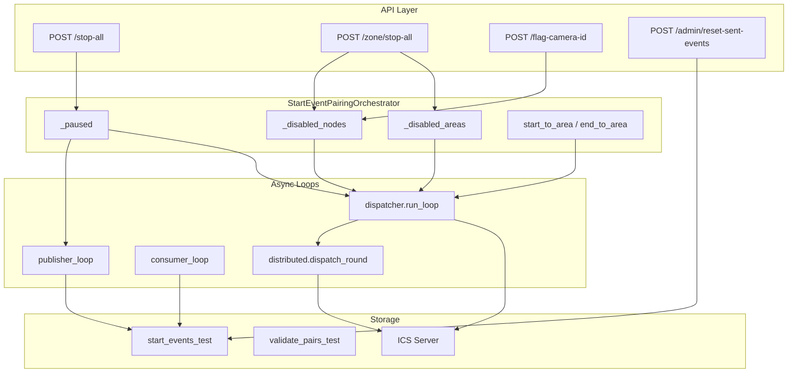

# 24-05 — Review / workflow / dataflow tổng hợp

Tài liệu cross-cutting cho toàn bộ thay đổi ngày 24-05. Chi tiết từng feature xem các file cùng prefix `24-05-*`.

## Danh sách thay đổi

| File doc | Nội dung |
|----------|----------|
| `24-05-stop-post-ics-khi-stop-camera.md` | Pause/disable pairing khi stop camera |
| `24-05-admin-reset-sent-events-api.md` | API reset Mongo sent → pending |
| `24-05-tach-distributed-dispatcher.md` | Refactor distributed single/double/empty |
| `24-05-chan-pairing-theo-area.md` | Block theo area_name |

## Kiến trúc tổng quan



## Files source bị ảnh hưởng

```
src/runtime/pairing/orchestrator.py
src/runtime/pairing/dispatcher.py
src/runtime/pairing/distributed_dispatcher.py
src/api_http/routes/cameras.py
src/api_http/routes/admin.py
src/api_http/state.py
src/api_http/app_factory.py
src/persistence/mongo/mongo_start_event_client.py
src/runtime/runtime_service.py
src/inference_core/state_manager.py
```

## Checklist review toàn bộ

### Orchestrator
- [ ] `_disabled_areas` clear trong `resume()`
- [ ] `end_to_area` load từ pair docs
- [ ] Lambda `get_disabled_areas` pass xuống dispatcher

### Dispatcher (local + distributed)
- [ ] Mọi POST ICS qua `_should_post_pair` hoặc `_should_post_empty`
- [ ] Empty không dùng `_should_post_pair`

### API
- [ ] Stop/start zone: nodes + areas
- [ ] Reset admin: global, không sync RAM

## Scenarios kiểm tra manual (10 case)

| # | Scenario | Kỳ vọng |
|---|----------|---------|
| 1 | Stop AE5, pair start AE5 + end AE5 local | Không POST |
| 2 | Stop AE5, pair start AE5 + end SUB5 | Không POST |
| 3 | Stop AE5, pair start SUB5 + end AE5 | Không POST |
| 4 | Stop AE5, empty start AE5 | Không POST empty |
| 5 | Stop AE5, empty start SUB5 | Vẫn POST empty |
| 6 | Stop-all | Không POST (pause) |
| 7 | Stop AE5, AE6 vẫn bật | AE6 POST, AE5 blocked |
| 8 | flag-camera-id disable 1 camera | Chỉ nodes camera blocked |
| 9 | POST /admin/reset-sent-events | Mongo sent → pending |
| 10 | Distributed cross-worker, stop area start | Worker B không POST |

## Tham chiếu nhanh API

```
POST /stop-all                    → pause pairing
POST /start-all                   → resume (clear all disabled)
POST /{zone}/stop-all             → disable_nodes + disable_areas
POST /{zone}/start-all            → enable_nodes + enable_areas
POST /flag-camera-id              → disable/enable nodes by camera
POST /admin/reset-sent-events     → Mongo reset sent → pending
```

## Rủi ro còn lại (known gaps)

1. Zone name ≠ area_name — disable area có thể miss
2. `_get_nodes_by_zone` empty nếu casing không khớp
3. Pair map stale — cần restart orchestrator
4. Reset API không sync RAM
5. Pending empty dropped khi blocked tại deadline
6. Publisher vẫn ghi Mongo khi zone stop (nếu không pause toàn hệ)

## Log

```
logs/start_event_pairing/log
logs/engine_control_routes/log
logs/admin_routes/log
logs/mongo_start_event_client/log
```
