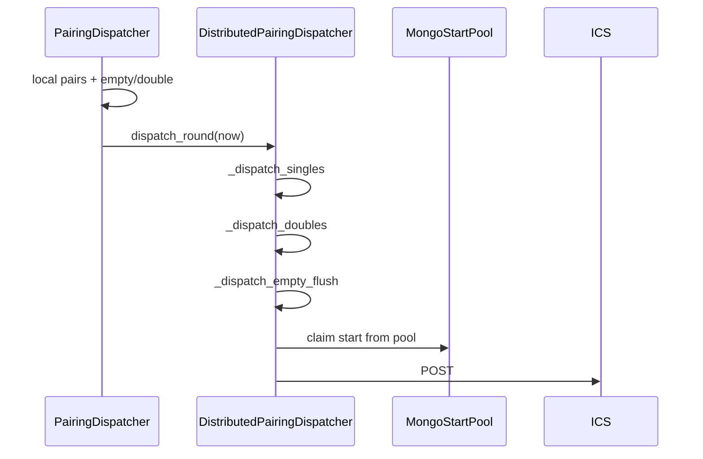

# 24-05 — Tách distributed dispatcher (single / double / empty)

## Tóm tắt thay đổi

Tách logic POST ICS phân tán khỏi `dispatcher.py` sang module riêng.

| Module | Trách nhiệm |
|--------|-------------|
| `dispatcher.py` | Local: double/empty, single local; gọi `distributed.dispatch_round()` |
| `distributed_dispatcher.py` | Distributed: singles, doubles (15s `pending_empty`), empty flush |

**Files mới:** `distributed_dispatcher.py`

---

## Quyết định ngoài spec

- **Double distributed same_as_local:** Dùng chung `pending_empty` + deadline 15s như local.
- **Không extract shared helper cho should_post:** Logic check duplicate giữa 2 class (đơn giản hóa).
- **`post_ics` inject qua callback:** Distributed dispatcher nhận `post_ics` từ local dispatcher.
- **Empty flush pop khi blocked:** Entry bị pop khỏi `pending_empty` thay vì retry.

## Thay đổi so với yêu cầu

| Yêu cầu | Thực tế |
|---------|---------|
| Tách `_dispatch_distributed_normals` | Đúng — thành `_dispatch_singles`, `_dispatch_doubles`, `_dispatch_empty_flush` |
| Local POST giữ trong dispatcher.py | Đúng |
| Double 15s pending_empty | Đúng — shared list |
| Distributed có should_post check | Đúng — bổ sung sau refactor |

## Trade-off

| Ưu | Nhược |
|----|-------|
| File nhỏ hơn, dễ đọc | Duplicate logic should_post giữa 2 class |
| Distributed có đủ single/double/empty | Phức tạp claim 2-phase cho double |
| Local và distributed tách rõ | Cần maintain 2 file khi đổi logic chặn |

## Review / workflow / dataflow

**Luồng distributed single:** end local ready → lookup `end_to_starts` → start trong pool → claim → POST.

**Checklist:** `_dispatch_singles` có should_post; doubles tách normal vs empty check; empty flush dùng `_should_post_empty`.

**Log:** `logs/start_event_pairing/log`
