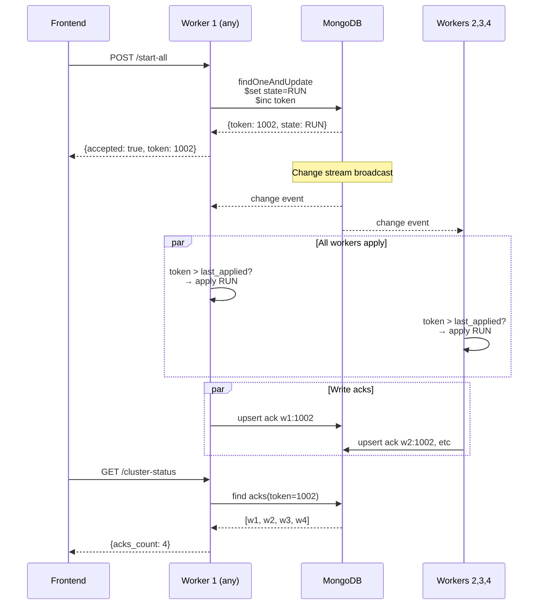

# 26-06 — MongoDB Cluster Control (Pub/Sub Pattern)

## Tóm tắt thay đổi

Chuyển đổi `/engine-control/start-all` và `/stop-all` từ local command sang cluster-wide command qua MongoDB coordination. Worker nhận HTTP POST chỉ ghi MongoDB; tất cả workers (bao gồm worker nhận POST) apply lệnh qua listener + change stream.

| API | Hành vi cũ | Hành vi mới |
|-----|-----------|-------------|
| `POST /start-all` | Chỉ worker nhận POST start camera local | Ghi MongoDB → 4 workers tự apply qua listener |
| `POST /stop-all` | Chỉ worker nhận POST stop camera local | Ghi MongoDB → 4 workers tự apply qua listener |
| `GET /cluster-status` | N/A | Trả về desired_state + acks từ workers |

**Files mới:** `mongo_cluster_control_client.py`, `cluster_control_listener.py`  
**Files sửa:** `cameras.py` (routes), `runtime_service.py`  
**Collections mới:** `engine_control_status`, `engine_control_acks`

---

## Quyết định ngoài spec

- **Worker nhận POST không chạy local:** Handler chỉ ghi MongoDB, apply qua listener (tránh double apply).
- **Bootstrap bắt buộc:** Worker restart/start phải đọc `engine_control_status` và apply nếu token mới.
- **Fallback polling 2s:** Khi change stream lỗi, tự động chuyển poll (trade latency cho reliability).
- **Token thay vì version:** Dùng `$inc token` để ordering (STOP→START nhanh vẫn đúng).
- **Ack không block:** Worker ghi ack sau apply, không đợi ack từ worker khác (eventual consistency).
- **Zone routes giữ local:** `/{zone}/start-all` vẫn gọi trực tiếp local (chỉ cluster start/stop qua Mongo).
- **Listener start sau components:** Chạy listener sau khi camera_manager + inference_engine đã init.
- **No master election:** Tất cả workers bình đẳng, MongoDB là coordination layer.

## Thay đổi so với yêu cầu

| Yêu cầu | Thực tế |
|---------|---------|
| VIP chọn worker → ghi Mongo | Đúng — bất kỳ worker nhận POST đều ghi |
| Worker nhận POST vừa ghi vừa apply local | **Không** — chỉ ghi Mongo, apply qua listener (dedupe) |
| Tất cả workers listen change stream | Đúng — với fallback polling |
| `fencing_token` cho ordering | Đúng — đặt tên `token` (đơn giản hơn) |
| Collection `engine_control_acks` | Đúng — track 4/4 workers đã apply |
| `find_one` khi bootstrap | Đúng — worker restart tự sync |

## Trade-off

| Ưu | Nhược |
|----|--------|
| **Decentralized:** Không cần master worker | **Eventual consistency:** Không đảm bảo 4/4 áp dụng đồng thời 100% |
| **Resilient:** Worker restart tự sync qua bootstrap | **Latency:** 1-2s (stream) hoặc 2-4s (poll) vs instant local |
| **Single POST:** FE chỉ gọi 1 lần, không cần biết có bao nhiêu workers | **Phụ thuộc MongoDB:** Control plane down khi MongoDB down |
| **Observable:** GET /cluster-status biết trạng thái + acks | **Replica set bắt buộc:** Change stream cần replica set (hoặc chỉ dùng polling) |
| **Idempotent:** Start/stop nhiều lần an toàn | **Partial observable:** Response "accepted" ≠ "4/4 applied" (cần poll status) |
| **Token ordering:** STOP→START liên tiếp đúng trạng thái cuối | **MongoDB write quyền:** Worker có quyền ghi status (cần auth nếu chặt) |
| **Fallback poll:** Vẫn hoạt động khi change stream lỗi | **No delivery guarantee:** Worker miss event cần bootstrap hoặc poll |

## Review / workflow / dataflow

### Luồng normal (4 workers healthy)



### Luồng worker restart (bootstrap)

```
1. Worker w3 down → system vẫn hoạt động (w1,w2,w4)
2. Operator: POST /start-all → token 1005
3. w1,w2,w4 apply RUN → acks_count = 3

4. Worker w3 starts:
   → RuntimeService.start()
   → Init camera_manager, inference_engine
   → Start ClusterControlListener
   → Bootstrap:
     * find_one({_id: "inference_status"})
     * Read: {desired_state: "RUN", token: 1005}
     * Check: 1005 > last_applied (-1) → apply RUN
     * Write ack w3:1005

5. GET /cluster-status → acks_count = 4
```

### Luồng fallback polling

```
Change stream error (replica set issue / network partition)
  ↓
Listener log: "Change stream unavailable; falling back to polling"
  ↓
Loop every 2s:
  → find_one({_id: "inference_status"})
  → Compare token với last_applied_token
  → If token mới → apply
  ↓
Latency tăng 2-4s (acceptable for degraded mode)
```

## Files source bị ảnh hưởng

**Mới:**
```
src/persistence/mongo/mongo_cluster_control_client.py
src/coordination/cluster_control_listener.py
docs/08-runbook/CLUSTER_CONTROL_TESTING.md
docs/08-runbook/CLUSTER_CONTROL_IMPLEMENTATION.md
updates/26-06-mongodb-cluster-control-pubsub.md
```

**Sửa:**
```
src/api_http/routes/cameras.py
  - start_all_cameras() → ghi MongoDB thay vì local
  - stop_all_cameras() → ghi MongoDB thay vì local
  - Thêm get_cluster_status()

src/runtime/runtime_service.py
  - __init__: thêm _cluster_listener, _cluster_listener_task
  - start(): init + start listener sau khi components ready
  - stop(): cleanup listener task
```

## Schema MongoDB cần setup

### Collection: engine_control_status
```javascript
// Document cố định _id
{
  "_id": "inference_status",
  "desired_state": "RUN",          // "RUN" | "STOP"
  "token": 1002,                   // Tăng dần mỗi lần update
  "updated_by_worker": "w1",       // Worker nhận HTTP POST (audit)
  "timestamp": "2026-06-02 14:30:00",
  "timestamp_utc": ISODate("...")
}

// Index: _id (mặc định)
```

### Collection: engine_control_acks
```javascript
// Nhiều documents (per worker per token)
{
  "worker_id": "w3",
  "token": 1002,
  "applied_state": "RUN",
  "applied_at": "2026-06-02 14:30:01",
  "applied_at_utc": ISODate("...")
}

// Index cần tạo:
db.engine_control_acks.createIndex(
  {worker_id: 1, token: 1}, 
  {unique: true}
)
```

## Những điều cần biết (beyond requirements)

### 1. Bootstrap là bắt buộc
Worker restart **phải** đọc status hiện tại và apply nếu token mới, nếu không sẽ lệch với cluster.

**Đã implement:** `ClusterControlListener.bootstrap()` gọi lúc `start()`.

### 2. Dedupe worker nhận POST
Worker nhận HTTP POST sẽ nhận lại change stream event của chính nó. Dedupe bằng `last_applied_token`.

**Đã implement:** Check `token > last_applied_token` trước khi apply.

### 3. Replica set requirement
Change stream **yêu cầu** MongoDB replica set. Standalone MongoDB chỉ chạy polling mode.

**Fallback đã có:** Tự động chuyển poll 2s khi stream lỗi.

### 4. Partial failure observability
Response `{accepted: true}` ≠ "4 workers đã chạy". Cần poll `GET /cluster-status` để biết `acks_count`.

**UI nên:** Hiển thị "Command accepted, syncing..." → Poll status → "4/4 workers ready".

### 5. Token vs state racing
Nếu operator bấm START → STOP → START nhanh (trong < 1s):
- Token tăng 3 lần: 1001 → 1002 → 1003
- State cuối: RUN (token 1003)
- Worker chỉ áp dụng token cao nhất → đúng state cuối

**Đã implement:** Token-based ordering.

### 6. MongoDB down = control plane down
Nếu MongoDB down:
- Worker không nhận được lệnh mới
- Worker restart không bootstrap được
- GET /cluster-status lỗi

**Mitigation:** MongoDB HA (replica set 3 nodes), monitor MongoDB health.

### 7. Change stream latency
Normal: < 1-2s. Nếu MongoDB tải cao hoặc network chậm: có thể lên 3-5s.

**Acceptable:** Control command không cần real-time < 100ms.

### 8. Ack không rollback
Worker apply thành công rồi ghi ack. Nếu apply lỗi → không ghi ack → `acks_count < 4`.

**Observe:** Log listener có "Error applying ... command".

### 9. Zone routes vẫn local
`POST /{zone}/start-all` **không** qua MongoDB (giữ nguyên local behavior).

**Lý do:** Zone-specific không cần cluster-wide (mỗi worker có camera khác nhau).

### 10. No retry trên worker
Worker apply fail **không tự retry**. Operator cần:
- Check logs
- Fix lỗi (ví dụ: camera config sai)
- POST lại hoặc restart worker

**Future enhancement:** Có thể thêm exponential backoff retry.

## Rủi ro còn lại (known gaps)

1. **No auth trên Mongo write:** Worker nào cũng ghi được `engine_control_status` → cần MongoDB RBAC nếu production.
2. **No command history:** Chỉ giữ state hiện tại, không log lịch sử ai bấm lúc nào → cần audit log riêng.
3. **No timeout ack:** Không tự động alert nếu worker không ack sau 30s → cần monitoring external.
4. **Listener exception không restart:** Nếu listener crash, không tự khởi động lại → worker bỏ lỡ lệnh.
5. **Token overflow:** Token tăng vô hạn (int64 → 9 quintillion commands OK, nhưng không reset).
6. **Zone/cluster command conflict:** Nếu zone start local + cluster stop đồng thời → behavior undefined (zone routes nên qua cluster sau).

## Checklist review toàn bộ

### MongoClusterControlClient
- [x] `update_desired_state()` atomic $set + $inc
- [x] `get_current_status()` trả default nếu chưa có document
- [x] `write_ack()` upsert với worker_id + token unique
- [x] `get_acks()` filter theo token

### ClusterControlListener
- [x] Bootstrap đọc status lúc start
- [x] Change stream với pipeline filter `_id: "inference_status"`
- [x] Fallback polling 2s khi stream lỗi
- [x] Dedupe theo `last_applied_token`
- [x] Guard: chỉ apply khi camera_manager init
- [x] Apply gọi đúng bộ 3: camera + inference + pairing
- [x] Ghi ack sau apply thành công

### Routes
- [x] `POST /start-all` ghi MongoDB, không gọi local
- [x] `POST /stop-all` ghi MongoDB, không gọi local
- [x] `GET /cluster-status` trả status + acks
- [x] Zone routes (`/{zone}/start-all`) giữ nguyên local

### Runtime integration
- [x] Listener start sau khi components init
- [x] Listener task chạy background
- [x] Cleanup listener trong stop()

## Scenarios kiểm tra manual (7 test cases)

| # | Scenario | Kỳ vọng | File test |
|---|----------|---------|-----------|
| 1 | Bootstrap: kill w3 → start w3 | w3 tự apply state hiện tại | CLUSTER_CONTROL_TESTING.md |
| 2 | Change stream: POST start-all | 4 workers apply trong < 2s | CLUSTER_CONTROL_TESTING.md |
| 3 | Fallback poll: stop replica set | Chuyển poll, vẫn hoạt động | CLUSTER_CONTROL_TESTING.md |
| 4 | Token ordering: START→STOP→START | State cuối là RUN | CLUSTER_CONTROL_TESTING.md |
| 5 | Partial failure: w3 down khi POST | 3 acks → w3 lên tự sync → 4 acks | CLUSTER_CONTROL_TESTING.md |
| 6 | Dedupe: worker nhận POST | Apply 1 lần, không double | CLUSTER_CONTROL_TESTING.md |
| 7 | Zone local: POST /AE5/start-all | Chỉ worker có AE5, không cluster | CLUSTER_CONTROL_TESTING.md |

## Tham chiếu nhanh API

```bash
# Cluster commands (qua MongoDB)
POST /engine-control/start-all     → Ghi RUN + inc token
POST /engine-control/stop-all      → Ghi STOP + inc token
GET  /engine-control/cluster-status → {status, acks, acks_count}

# Zone commands (vẫn local)
POST /engine-control/{zone}/start-all → Local camera_manager.set_zone_enabled
POST /engine-control/{zone}/stop-all  → Local camera_manager.set_zone_enabled

# Monitoring
GET  /runtime/status                → Worker runtime info (local)
```

## Log

```
logs/cluster_control_listener/log_*.log     → Bootstrap, change, apply, ack
logs/mongo_cluster_control_client/log_*.log → Mongo operations
logs/engine_control_routes/log_*.log        → HTTP requests
logs/runtime_service/log_*.log              → Listener lifecycle
```

## Migration path (nếu rollback cần)

1. **Rollback code:** Revert cameras.py + runtime_service.py
2. **Không xóa collections:** Giữ `engine_control_status` và `engine_control_acks` (không ảnh hưởng)
3. **FE không cần đổi:** Routes `/start-all` vẫn tồn tại, chỉ đổi behavior

**Forward migration:**
- Deploy code mới → workers restart → listener tự start
- Không cần migrate data (collections tạo mới)
- FE có thể dùng luôn, không downtime

## Performance impact

| Metric | Before | After | Note |
|--------|--------|-------|------|
| Latency POST | < 50ms | < 100ms | Thêm MongoDB write |
| Latency apply | 0s (local) | 1-2s (stream) | Eventual consistency |
| Mongo load | N/A | +2 collections, low write (< 1 op/min) | Negligible |
| Worker CPU | N/A | +1 listener thread | < 1% |

## Tài liệu liên quan

- `docs/08-runbook/CLUSTER_CONTROL_TESTING.md` — Testing guide chi tiết
- `docs/08-runbook/CLUSTER_CONTROL_IMPLEMENTATION.md` — Implementation summary
- `docs/03-flows/01_worker_registration_heartbeat_flow.md` — Worker coordination hiện có
- `src/runtime/pairing/mongo_pool.py` — Pattern change stream + poll fallback
